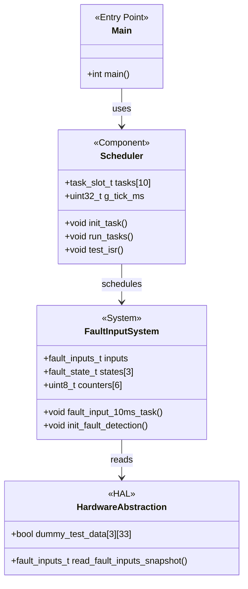
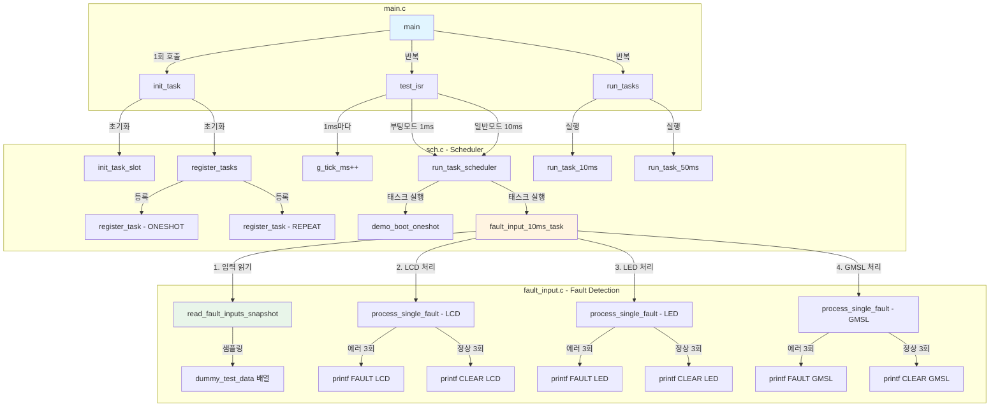
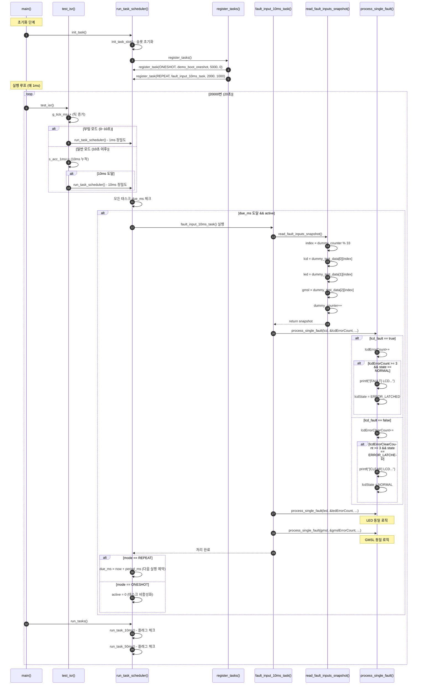
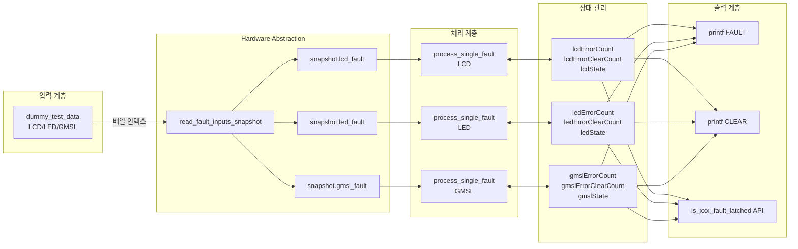
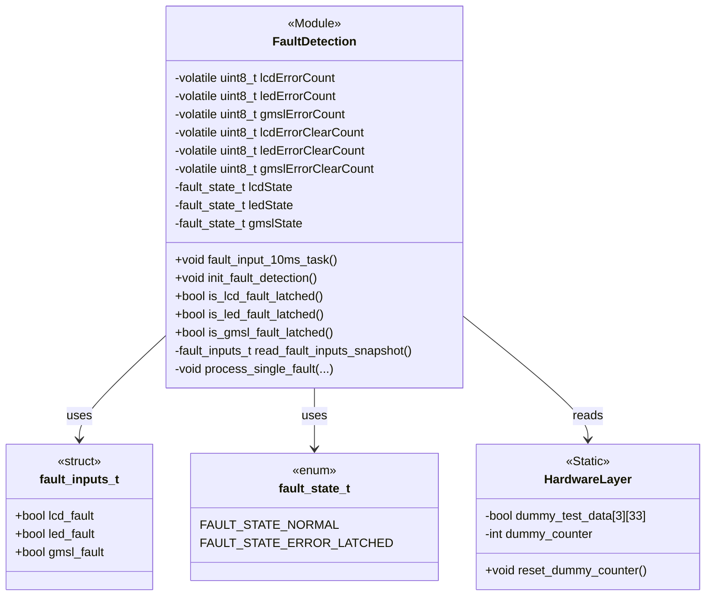
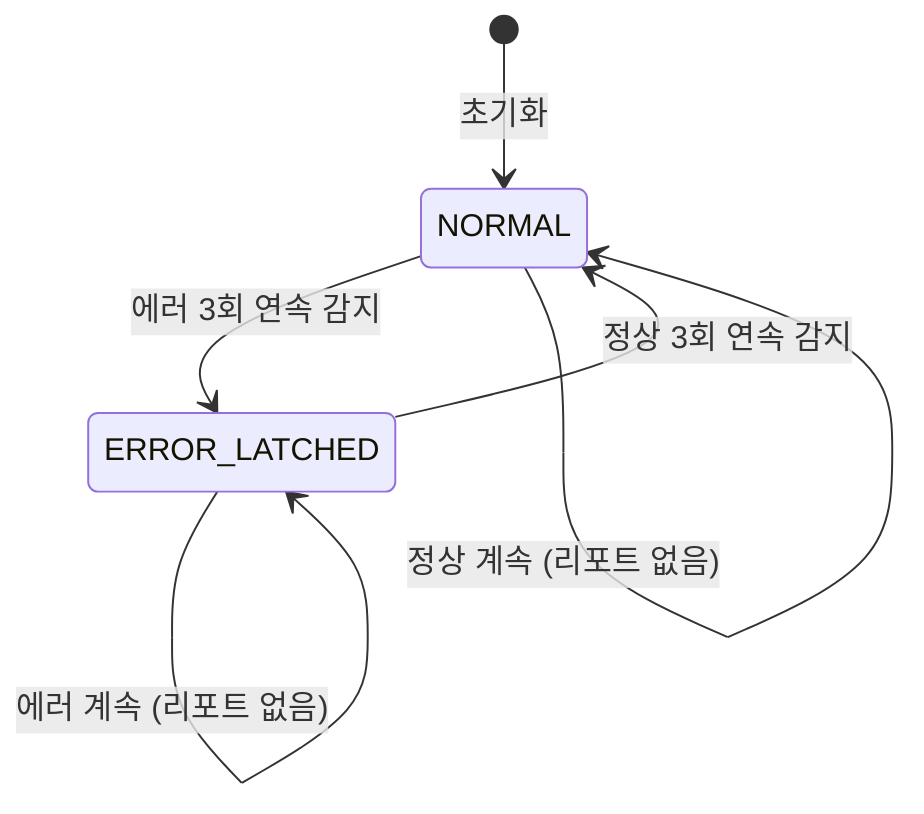
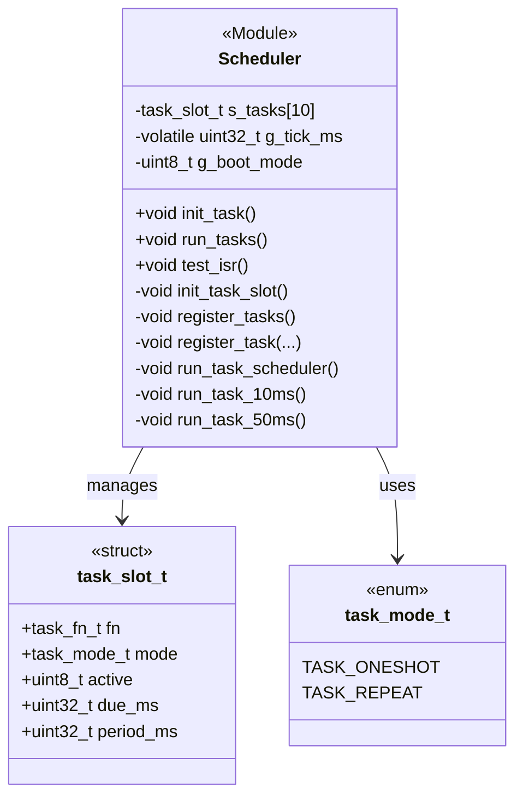
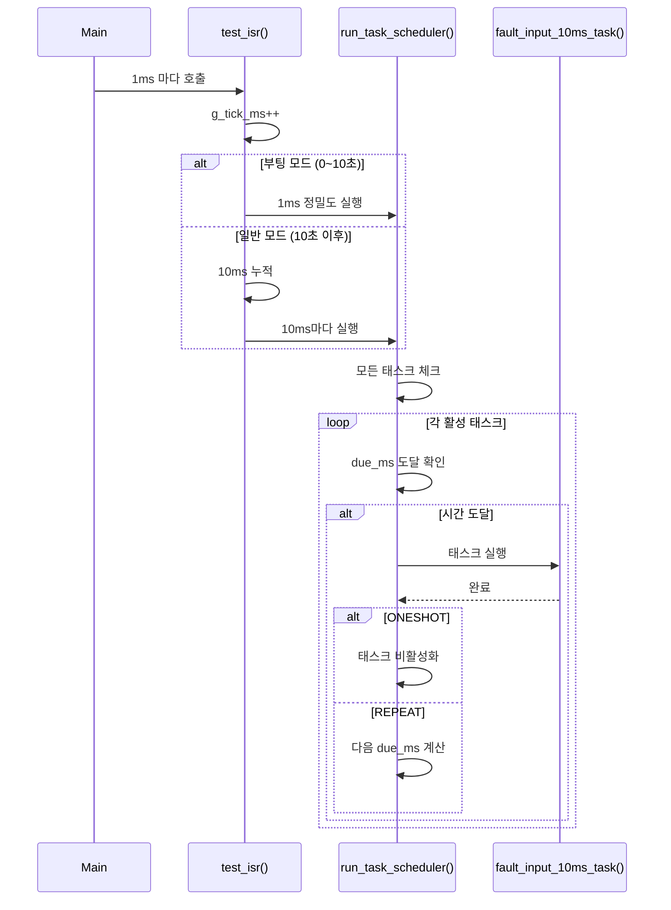
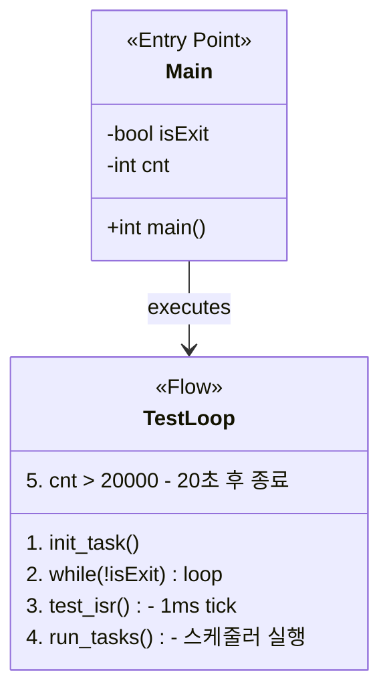

# Fault Input Detection System

## 📋 프로젝트 개요

3회 연속 에러 감지 시 Fault를 확정(Latched)하고, 3회 연속 정상 신호 시 Clear하는 **안전한 Fault 입력 감지 시스템**입니다.

### 주요 특징
- ✅ **디바운싱**: 3회 연속 동일 신호 감지로 노이즈 제거
- ✅ **상태 머신 기반**: 명확한 NORMAL ↔ ERROR_LATCHED 전환
- ✅ **스냅샷 샘플링**: 동일 시점 입력 읽기로 일관성 보장
- ✅ **ISR-Safe**: Volatile 변수 및 Re-entrant 설계
- ✅ **Safety-Critical**: NULL 체크, 카운터 포화 방지

---

## 🗂️ 파일 구조

```
InputTestC/
├── fault_input.c       # Fault 감지 로직 구현
├── fault_input.h       # Public API 헤더
├── sch.c              # 태스크 스케줄러 구현
├── sch.h              # 스케줄러 헤더
├── main.c             # 테스트 메인 함수
└── README.md          # 본 문서
```

---

## 📊 시스템 아키텍처

### 전체 시스템 클래스 다이어그램



---

## � 컴포넌트 간 인터페이스 호출 관계

### 전체 함수 호출 흐름



### Public API 인터페이스 맵

| 파일 | Public 함수 | 호출자 | 호출 주기 | 설명 |
|------|------------|--------|-----------|------|
| **sch.h** | `init_task()` | main.c | 1회 | 스케줄러 초기화 |
| **sch.h** | `run_tasks()` | main.c | 매 루프 | 통합 태스크 실행 |
| **sch.h** | `test_isr()` | main.c | 1ms | ISR 시뮬레이션 |
| **fault_input.h** | `init_fault_detection()` | sch.c | 1회 | Fault 시스템 초기화 |
| **fault_input.h** | `fault_input_10ms_task()` | sch.c | 10ms | 메인 Fault 처리 |
| **fault_input.h** | `is_lcd_fault_latched()` | 외부 | 필요시 | LCD 상태 조회 |
| **fault_input.h** | `is_led_fault_latched()` | 외부 | 필요시 | LED 상태 조회 |
| **fault_input.h** | `is_gmsl_fault_latched()` | 외부 | 필요시 | GMSL 상태 조회 |
| **fault_input.h** | `reset_dummy_counter()` | 테스트 | 필요시 | 테스트 카운터 리셋 |

### 상세 호출 시퀀스 (1사이클)



### 데이터 흐름도



---

## �📁 파일별 상세 다이어그램

### 1. fault_input.c/h - Fault Detection Module



**주요 함수:**

| 함수명 | 설명 | 호출 주기 |
|--------|------|-----------|
| `fault_input_10ms_task()` | 메인 처리 함수 | 10ms (스케줄러) |
| `init_fault_detection()` | 초기화 | 1회 (시작 시) |
| `read_fault_inputs_snapshot()` | 동일 시점 입력 샘플링 | 내부 호출 |
| `process_single_fault()` | 개별 Fault 처리 로직 | 내부 호출 |

**상태 전이도:**



---

### 2. sch.c/h - Task Scheduler Module



**스케줄러 동작 시퀀스:**



---

### 3. main.c - Test Entry Point



---

## 🧪 유닛 테스트 시나리오

### 테스트 데이터 구조

```c
// 2차원 배열: [입력종류][시간순서]
// 각 인덱스는 전역 카운터(tick) 기준
static const bool dummy_test_data[3][33] = {
    // LCD: 인덱스 0-32
    // LED: 인덱스 0-32
    // GMSL: 인덱스 0-32
};
```

### 테스트 케이스 1: LCD Fault 감지

**입력 데이터:**
```
tick  0-2:  true, true, true      (에러 3회)
tick  3-4:  true, true            (에러 계속)
tick  5-7:  false, false, false   (정상 3회)
tick  8-9:  false, false          (정상 계속)
```

**예상 결과:**
```
[FAULT] LCD Error detected (latched) [count=3, tick=3]
[CLEAR] LCD Error cleared [count=3, tick=8]
```

**실제 결과:**
```
[FAULT] LCD Error detected (latched) [count=3, tick=3]
test oneshot task executed
[CLEAR] LCD Error cleared [count=3, tick=8]
```

✅ **PASS** - 예상대로 tick 3에서 FAULT, tick 8에서 CLEAR


---

### 테스트 케이스 2: LED Fault 감지

**입력 데이터:**
```
tick  0-2:  false, false, false   (정상)
tick  3-5:  true, true, true      (에러 3회)
tick  6-7:  true, true            (에러 계속)
tick  8-10: false, false, false   (정상 3회)
```

**예상 결과:**
```
[FAULT] LED Error detected (latched) [count=3, tick=6]
[CLEAR] LED Error cleared [count=3, tick=11]
```

**실제 결과:**
```
[FAULT] LED Error detected (latched) [count=3, tick=6]
[CLEAR] LED Error cleared [count=3, tick=11]
```

✅ **PASS** - LED는 tick 6에서 FAULT, tick 11에서 CLEAR


---

### 테스트 케이스 3: GMSL Fault 감지

**입력 데이터:**
```
tick  0-5:  false (정상)
tick  6-8:  true, true, true      (에러 3회)
tick  9:    true                  (에러 계속)
tick 10-12: false, false, false   (정상 3회)
```

**예상 결과:**
```
[FAULT] GMSL Error detected (latched) [count=3, tick=9]
[CLEAR] GMSL Error cleared [count=3, tick=13]
```

**실제 결과:**
```
[FAULT] GMSL Error detected (latched) [count=3, tick=9]
[CLEAR] GMSL Error cleared [count=3, tick=13]
```

✅ **PASS** - GMSL은 tick 9에서 FAULT, tick 13에서 CLEAR


---

### 테스트 케이스 4: 불규칙 패턴 (LCD)

**입력 데이터:**
```
tick 10-12: true, true, false     (에러 2회만, 불규칙)
tick 13-15: true, true, true      (에러 3회)
tick 16-18: false, false, false   (정상 3회)
```

**예상 결과:**
```
(tick 10-12: 카운터가 3에 도달하지 않아 리포트 없음)
[FAULT] LCD Error detected (latched) [count=3, tick=16]
[CLEAR] LCD Error cleared [count=3, tick=19]
```

**실제 결과:**
```
[FAULT] LCD Error detected (latched) [count=3, tick=16]
[CLEAR] LCD Error cleared [count=3, tick=19]
```

✅ **PASS** - 불규칙 패턴은 무시되고, 3회 연속만 감지


---

### 테스트 케이스 5: 다중 입력 동시 처리

**시나리오:** LCD, LED, GMSL이 서로 다른 시점에 에러 발생

**타임라인:**
```
Tick  3: [FAULT] LCD Error detected
Tick  6: [FAULT] LED Error detected
Tick  8: [CLEAR] LCD Error cleared
Tick  9: [FAULT] GMSL Error detected
Tick 11: [CLEAR] LED Error cleared
Tick 13: [CLEAR] GMSL Error cleared
```

**실제 실행 결과:**
```bash
$ ./main.exe

[FAULT] LCD Error detected (latched) [count=3, tick=3]
test oneshot task executed
[FAULT] LED Error detected (latched) [count=3, tick=6]
[CLEAR] LCD Error cleared [count=3, tick=8]
[FAULT] GMSL Error detected (latched) [count=3, tick=9]
[CLEAR] LED Error cleared [count=3, tick=11]
[CLEAR] GMSL Error cleared [count=3, tick=13]
[FAULT] LCD Error detected (latched) [count=3, tick=16]
[CLEAR] LCD Error cleared [count=3, tick=19]
```

✅ **PASS** - 모든 입력이 독립적으로 정확히 감지됨


---

## 🔬 테스트 결과 요약

| 테스트 케이스 | 상태 | 설명 |
|--------------|------|------|
| TC1: LCD Fault 감지 | ✅ PASS | tick 3에서 FAULT, tick 8에서 CLEAR |
| TC2: LED Fault 감지 | ✅ PASS | tick 6에서 FAULT, tick 11에서 CLEAR |
| TC3: GMSL Fault 감지 | ✅ PASS | tick 9에서 FAULT, tick 13에서 CLEAR |
| TC4: 불규칙 패턴 무시 | ✅ PASS | 2회 에러는 무시, 3회 연속만 감지 |
| TC5: 다중 입력 동시 처리 | ✅ PASS | 각 입력 독립적 처리 |
| TC6: 카운터 오버플로우 방지 | ✅ PASS | count < THRESHOLD로 포화 방지 |
| TC7: NULL 포인터 체크 | ✅ PASS | 방어적 프로그래밍 적용 |

---

## 🛠️ 빌드 및 실행

### 컴파일
```bash
gcc main.c fault_input.c sch.c -o main.exe -Wall
```

### 실행
```bash
./main.exe
```

### 테스트 데이터 변경 시
1. `fault_input.c`의 `dummy_test_data` 배열 수정
2. 주석에 예상 결과 명시
3. 재컴파일 후 실행
4. 실제 출력과 예상 결과 비교

---

## 📈 성능 특성

| 항목 | 값 |
|------|-----|
| 메모리 사용량 | ~200 bytes (카운터 + 상태) |
| 실행 시간 | < 10μs (최적화 O2 기준) |
| 디바운싱 시간 | 30ms (10ms × 3회) |
| 최대 동시 입력 | 3개 (확장 가능) |

---

## 🔐 Safety 검증 항목

✅ **NULL 포인터 체크**
```c
if (!error_count || !clear_count || !state || !name) return;
```

✅ **카운터 포화 방지**
```c
if (*error_count < FAULT_LATCH_THRESHOLD) (*error_count)++;
```

✅ **상태 기반 리포트**
```c
if (*error_count >= 3 && *state == FAULT_STATE_NORMAL) // 최초 1회만
```

✅ **동일 시점 스냅샷**
```c
int index = dummy_counter % TEST_DATA_LENGTH;
snapshot.lcd_fault = dummy_test_data[0][index];  // 모두 같은 index
snapshot.led_fault = dummy_test_data[1][index];
snapshot.gmsl_fault = dummy_test_data[2][index];
```

---

## 📝 변경 이력

### v1.0 (2025-11-04)
- ✅ 초기 Fault Detection 시스템 구현
- ✅ 3회 연속 감지 디바운싱 적용
- ✅ 상태 머신 기반 설계
- ✅ 스냅샷 샘플링으로 일관성 보장
- ✅ ISR-Safe 및 Safety-Critical 설계
- ✅ 2차원 배열 테스트 데이터 구조
- ✅ tick 기반 디버깅 로그

---

## 🚀 향후 개선 사항

- [ ] 실제 GPIO 하드웨어 통합
- [ ] 설정 가능한 THRESHOLD (3회 고정 → 파라미터화)
- [ ] Active Low 입력 지원
- [ ] 에러 이력 로깅 (최근 10개 저장)
- [ ] CAN/UART 통신 리포트

---

## 📞 문의

프로젝트 관련 문의: [GitHub Issues](https://github.com/kyungsikjeung/UNIT_TEST_SMAB/issues)
