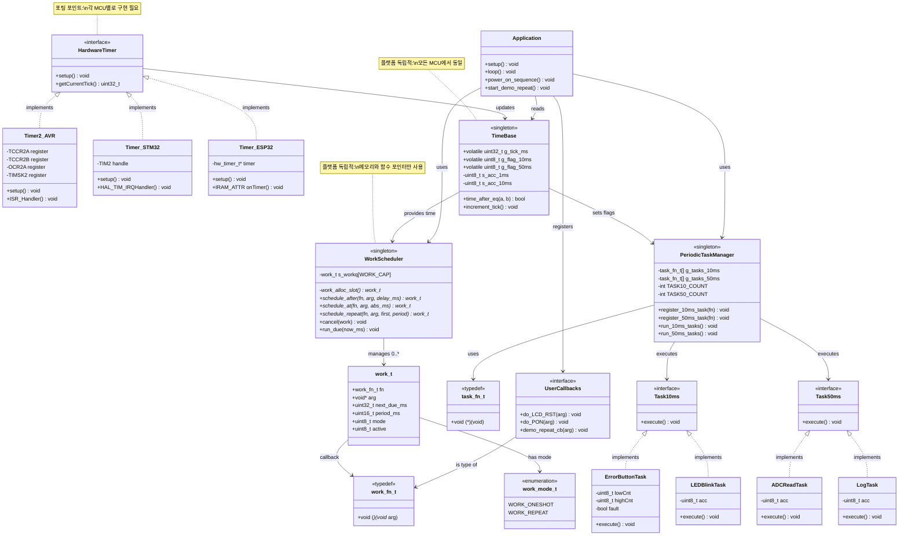

```mermaid
classDiagram
    %% ===== Hardware Abstraction Layer =====
    class HardwareTimer {
        <<interface>>
        +setup() void
        +getCurrentTick() uint32_t
    }
    
    class Timer2_AVR {
        -TCCR2A register
        -TCCR2B register
        -OCR2A register
        -TIMSK2 register
        +setup() void
        +ISR_Handler() void
    }
    
    class Timer_STM32 {
        -TIM2 handle
        +setup() void
        +HAL_TIM_IRQHandler() void
    }
    
    class Timer_ESP32 {
        -hw_timer_t* timer
        +setup() void
        +IRAM_ATTR onTimer() void
    }
    
    HardwareTimer <|.. Timer2_AVR : implements
    HardwareTimer <|.. Timer_STM32 : implements
    HardwareTimer <|.. Timer_ESP32 : implements
    
    %% ===== Core Scheduler Components =====
    class TimeBase {
        <<singleton>>
        +volatile uint32_t g_tick_ms
        +volatile uint8_t g_flag_10ms
        +volatile uint8_t g_flag_50ms
        -uint8_t s_acc_1ms
        -uint8_t s_acc_10ms
        +time_after_eq(a, b) bool
        +increment_tick() void
    }
    
    class WorkScheduler {
        <<singleton>>
        -work_t s_workq[WORK_CAP]
        -work_alloc_slot() work_t*
        +schedule_after(fn, arg, delay_ms) work_t*
        +schedule_at(fn, arg, abs_ms) work_t*
        +schedule_repeat(fn, arg, first, period) work_t*
        +cancel(work) void
        +run_due(now_ms) void
    }
    
    class work_t {
        +work_fn_t fn
        +void* arg
        +uint32_t next_due_ms
        +uint16_t period_ms
        +uint8_t mode
        +uint8_t active
    }
    
    class work_fn_t {
        <<typedef>>
        +void (*)(void* arg)
    }
    
    class work_mode_t {
        <<enumeration>>
        WORK_ONESHOT
        WORK_REPEAT
    }
    
    %% ===== Periodic Task System =====
    class PeriodicTaskManager {
        <<singleton>>
        -task_fn_t[] g_tasks_10ms
        -task_fn_t[] g_tasks_50ms
        -int TASK10_COUNT
        -int TASK50_COUNT
        +register_10ms_task(fn) void
        +register_50ms_task(fn) void
        +run_10ms_tasks() void
        +run_50ms_tasks() void
    }
    
    class task_fn_t {
        <<typedef>>
        +void (*)(void)
    }
    
    class Task10ms {
        <<interface>>
        +execute() void
    }
    
    class Task50ms {
        <<interface>>
        +execute() void
    }
    
    class ErrorButtonTask {
        -uint8_t lowCnt
        -uint8_t highCnt
        -bool fault
        +execute() void
    }
    
    class LEDBlinkTask {
        -uint8_t acc
        +execute() void
    }
    
    class ADCReadTask {
        -uint8_t acc
        +execute() void
    }
    
    class LogTask {
        -uint8_t acc
        +execute() void
    }
    
    %% ===== Main Application Layer =====
    class Application {
        +setup() void
        +loop() void
        +power_on_sequence() void
        +start_demo_repeat() void
    }
    
    class UserCallbacks {
        <<interface>>
        +do_LCD_RST(arg) void
        +do_PON(arg) void
        +demo_repeat_cb(arg) void
    }
    
    %% ===== Relationships =====
    HardwareTimer --> TimeBase : updates
    TimeBase --> WorkScheduler : provides time
    TimeBase --> PeriodicTaskManager : sets flags
    
    WorkScheduler --> work_t : manages 0..*
    work_t --> work_fn_t : callback
    work_t --> work_mode_t : has mode
    
    PeriodicTaskManager --> Task10ms : executes
    PeriodicTaskManager --> Task50ms : executes
    PeriodicTaskManager --> task_fn_t : uses
    
    Task10ms <|.. ErrorButtonTask : implements
    Task10ms <|.. LEDBlinkTask : implements
    Task50ms <|.. ADCReadTask : implements
    Task50ms <|.. LogTask : implements
    
    Application --> WorkScheduler : uses
    Application --> PeriodicTaskManager : uses
    Application --> TimeBase : reads
    Application --> UserCallbacks : registers
    UserCallbacks --> work_fn_t : is type of
    
    %% ===== Notes =====
    note for HardwareTimer "포팅 포인트:\n각 MCU별로 구현 필요"
    note for TimeBase "플랫폼 독립적:\n모든 MCU에서 동일"
    note for WorkScheduler "플랫폼 독립적:\n메모리와 함수 포인터만 사용"
```